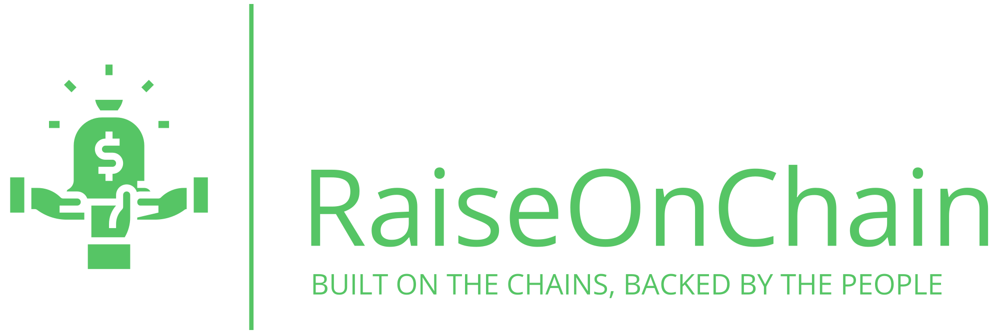

<!-- Banner & Logo -->
<p align="center">
  
</p>

<p align="center"><b>Decentralized Crowdfunding Platform on Blockchain</b></p>
<p align="center">
  
  
  
  
  
</p>

---

<p align="center">
  <b>Empowering transparent, secure, and global fundraising—directly on the blockchain.</b>
</p>

---

# ✨ Features

- 🚀 <b>Decentralized Campaign Creation</b>: Immutably stored on the blockchain
- 👁️ <b>Transparent Donations</b>: All contributions are public and on-chain
- 📈 <b>Real-time Progress Tracking</b>: Live funding and donor activity
- 🦊 <b>Wallet Integration</b>: Seamless MetaMask/Web3 support
- 🤝 <b>Trustless Interactions</b>: Smart contracts manage all funds
- 🧾 <b>Donor Transparency</b>: Public donor lists and histories
- 🛡️ <b>Smart Contract Security</b>: Automated, no human intervention
- 🌍 <b>Global Accessibility</b>: No borders, no central control

---

# 👥 Team

<table>
  <tr>
    <td align="center"><br/><b>Rasad Regmi</b><br/>Lead Dev</td>
    <td align="center"><br/><b>Sahira Maharjan</b><br/>Frontend Dev</td>
    <td align="center"><br/><b>Regish Shrestha</b><br/>Blockchain Dev</td>
    <td align="center"><br/><b>Aditya Thakuri</b><br/>Researcher & UI/UX</td>
  </tr>
</table>

---

# 🏗️ Architecture

## 🛠️ Smart Contract Layer
- <b>Solidity & Thirdweb</b>
- Campaign creation, donation processing, immutable on-chain storage

## 💻 Frontend Application
- <b>React.js + Tailwind CSS</b>
- Custom Web3 Context (Thirdweb SDK)
- Modern, responsive UI

## 🗄️ Storage & Deployment
- **All campaign data and images are stored on-chain or locally.**
- **Blockchain** for all data/transactions (Localhost 8545 or Sepolia)

---

# 🚀 Quick Start

> **Requirements:** Node.js (v18+), MetaMask, Git, Hardhat (Localhost 8545 or Sepolia)

```bash
# 1. Clone the repository
git clone <your-repo-url>
cd RaiseOnChain

# 2. Install dependencies
npm install
cd client && npm install

# 3. Start Hardhat node (new terminal)
npx hardhat node

# 4. Deploy smart contract (choose network)
# For localhost:
npx hardhat run scripts/deploy.js --network localhost
# For Sepolia:
npx hardhat run scripts/deploy.js --network sepolia

# 5. Start frontend (in client/)
npm run dev
```

> 💡 **Tip:** After deploying, update the contract address in `client/.env` and `client/src/services/contractService.js` for the correct network.

---

# 🧩 Project Structure

```text
RaiseOnChain/
├── contracts/                 # Smart contracts
│   └── CrowdfundingCampaign.sol
├── client/                    # React frontend
│   ├── src/
│   │   ├── components/        # React components
│   │   ├── pages/             # Page components
│   │   ├── contexts/          # Web3 context
│   │   ├── services/          # Contract services
│   │   └── assets/            # Static assets
│   └── package.json
├── deploy.js                  # Deployment script
├── thirdweb.config.js         # Thirdweb configuration
└── package.json
```

---

# 🧑‍💻 How It Works

<details>
<summary><b>1. Create Your Campaign</b></summary>
<ul>
  <li>Set up your campaign with a goal, description, deadline, and images.</li>
  <li>All data is stored on-chain for transparency.</li>
</ul>
</details>

<details>
<summary><b>2. Connect Your Wallet</b></summary>
<ul>
  <li>Connect MetaMask to Localhost 8545 or Sepolia.</li>
  <li>Use pre-funded Hardhat accounts (localhost) or Sepolia faucet ETH.</li>
</ul>
</details>

<details>
<summary><b>3. Make Donations</b></summary>
<ul>
  <li>Donate ETH directly to campaigns.</li>
  <li>All transactions are public and transparent.</li>
</ul>
</details>

<details>
<summary><b>4. Funds Released</b></summary>
<ul>
  <li>Funds can be withdrawn by the beneficiary when the campaign goal is met or the deadline passes.</li>
</ul>
</details>

---

# 🏆 Key Advantages

- <b>Decentralized</b>: No central authority, smart contracts handle everything
- <b>Transparent</b>: All data and transactions are public
- <b>Secure</b>: Blockchain ensures funds can't be tampered with
- <b>Global</b>: Anyone, anywhere, anytime

---

# 💡 Why Blockchain?

> <b>Traditional Crowdfunding Issues:</b>
> - High platform fees
> - Lack of transparency
> - Centralized control/censorship
> - Geographic restrictions

> <b>RaiseOnChain Solutions:</b>
> - Minimal gas fees only
> - Full transparency (public blockchain)
> - Decentralized, censorship-resistant
> - Global access

---

# 🛠️ Technology Stack

| Component         | Technology                |
|-------------------|--------------------------|
| **Blockchain**    | Ethereum (Localhost 8545 or Sepolia) |
| <b>Smart Contracts</b> | Solidity, Thirdweb      |
| <b>Frontend</b>      | React.js, Vite           |
| <b>Styling</b>       | Tailwind CSS             |
| <b>Web3 Integration</b> | Thirdweb SDK           |
| <b>Wallet Support</b> | MetaMask                |
| <b>Storage</b>       | On-chain / Local         |

---

# 🤝 Contributing

We welcome contributions from the community!

1. <b>Fork</b> the repository
2. <b>Create your feature branch</b>
   <pre>git checkout -b feature/AmazingFeature</pre>
3. <b>Commit your changes</b>
   <pre>git commit -m 'Add some AmazingFeature'</pre>
4. <b>Push to your branch</b>
   <pre>git push origin feature/AmazingFeature</pre>
5. <b>Open a Pull Request</b>

> <b>Guidelines:</b> Follow code style, add tests, update docs, ensure all tests pass.

---

# 🐛 Troubleshooting

<details>
<summary><b>MetaMask Connection Issues</b></summary>
<ul>
  <li>Ensure MetaMask is installed and unlocked</li>
  <li>Check you're on Localhost 8545 or Sepolia</li>
  <li>Refresh the page if needed</li>
</ul>
</details>

<details>
<summary><b>Contract Deployment Issues</b></summary>
<ul>
  <li>Check ETH balance for gas</li>
  <li>Wallet must be on Localhost 8545 or Sepolia</li>
  <li>Install all dependencies</li>
</ul>
</details>

<details>
<summary><b>Transaction Failures</b></summary>
<ul>
  <li>Check ETH balance</li>
  <li>Verify gas fees</li>
  <li>Ensure correct network</li>
</ul>
</details>

---

# 📄 License

MIT License. See [LICENSE](LICENSE) for details.

---

# 🙏 Acknowledgments

- [Thirdweb](https://thirdweb.com) for Web3 tools
- [Ethereum Foundation](https://ethereum.org) for blockchain infra
- [MetaMask](https://metamask.io) for wallet integration
- [Tailwind CSS](https://tailwindcss.com) for UI

---


